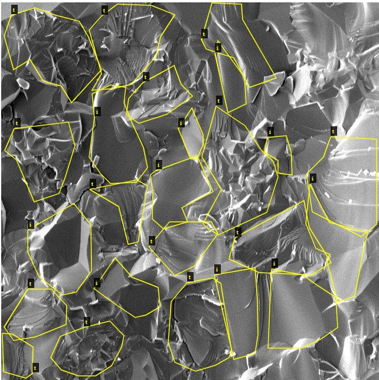
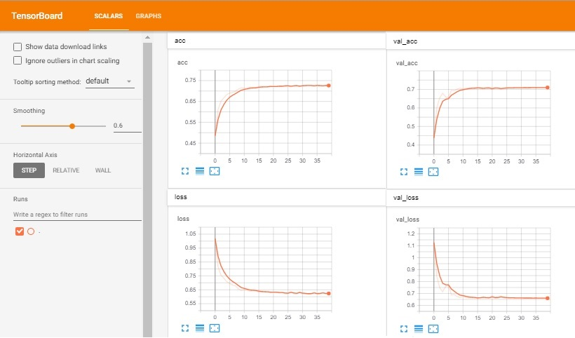
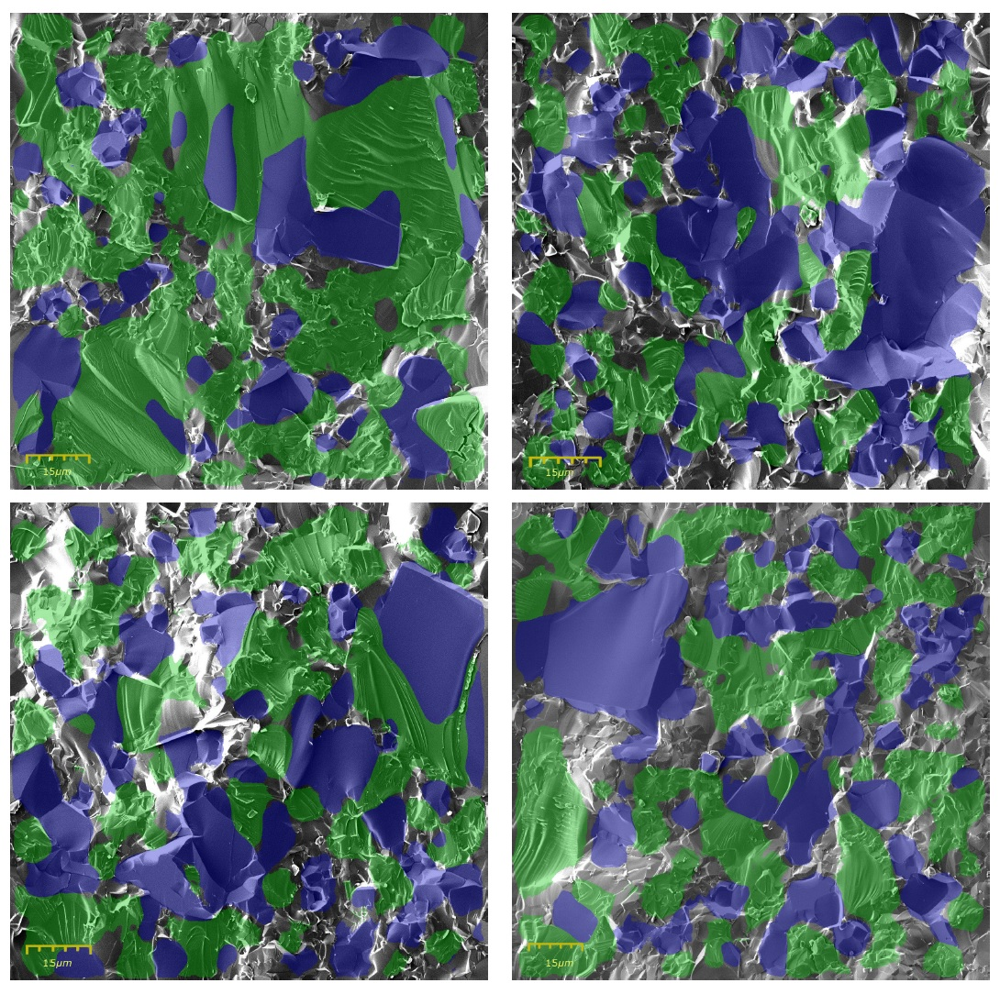

# Quantitative Fractography Semantic Segmentation

This repository is created to present the training process and the predictions results that are published on the scientific research work: _" Toward quantitative fractography using convolutional neural networks "_(https://arxiv.org/abs/1908.02242).

The source code is a modification of the code published at [image-segmentation-keras](https://github.com/divamgupta/image-segmentation-keras) developed by https://divamgupta.com, with the addition of some extra tools needed for the training process. 

The main objective of publishing this work is to propose a new method for the topographic charactirization of fracture surfaces based on Convolutional Neural Networks and attract the interest of the Fractography research community in order to built on this basis and develop tools that optimize the Quantitative Fractogrphy techniques. 

More specifically, the Convolutional Neural Network (CNN) model after being trained in Scanning Electron Microscopy (SEM) images of fracture surfaces is able to identify the _intergranular_ or _transgranular_ fracture modes for any brittle material.


## Annotation of the training and validation datasets

The first part of the training of every Convolutional Neural Network (CNN) model involveds the annotation of the images. In our case the dataset is composed by SEM images of the fracture surfaces. 

The annotation for the SEM fracture images has been performed with the online open source VGG Image Annotator (http://www.robots.ox.ac.uk/~vgg/software/via/via.html). Using the polygon tool it becomes possible to label the different areas of the SEM images as _intergranular_ or _transgranular_, while the areas that were more ambiguous or between the borders of adjucent areas were classified as _background_. Furthermore, the image annotation is a very time consuming task and the introduction of the _background_ label was necessary.

<p align="center">
  
</p>

After annotating around 1000 images (with size 640x640), the next step is to convert the annotations into a format that is suitable for the training program. This is done using the __Export_annotations.py__ script in the __Convert_VGG_Annotations__ folder.  


## Training the network

The code for training the network and performing the predictions is using Keras with Tensorflow as a backend. 
The __train.py__ code is used to train the network and the following command line arguments need to be defined:

- __save_weights_path__ : directory to save the .hdf5 file of the trained weights
- __train_images__ : directory of the training dataset (_/Convert_VGG_Annotations/fracture_images/train_)
- __val_images__ : directory of the validation dataset (_/Convert_VGG_Annotations/fracture_images/val_)
- __train_annotations__ : directory of the annotations of the training dataset (_/Convert_VGG_Annotations/annotations/train_)
- __val_annotations__ : directory of the annotations of the validation dataset (_/Convert_VGG_Annotations/annotations/val_)
- __logs__ : directory of Tensorboard log files
- __n_classes__ : number of classes (including the _background_ class)
- __input_height__ : height in pixels of the train and val images(default value: _640_) 
- __input_width__ : width in pixels of the train and val images(default value: _640_) 
- __start_epoch__ : initial epoch to start the training - _if it is a new training, use the default value zero_
- __end_epoch__ : final training epoch
- __epoch_steps__ : number of iterations per epoch
- __batch_size__ : depending on the GPU memory of your computer, define the batch size for training
- __val_batch_size__ : depending on the GPU memory of your computer, define the batch size for training
- __init_learning_rate__ : learning rate of training
- __optimizer_name__ : choose optimizer - _options: rmsprop, adadelta, sgd. Default parameter: adam    
- __load_weights__ : directory of the pre-trained weights, in case of continuing the training from previous pre-trained stage. No need to define this in case of starting a new training. 

An example of execution command is:

```
python train.py --save_weights_path="weights/" --logs="logs/" --start_epoch=0 \
                --train_images="Convert_VGG_Annotations/fracture_images/train/" \
                --train_annotations="Convert_VGG_Annotations/annotations/train/" \
                --val_images="Convert_VGG_Annotations/fracture_images/val/" \
                --val_annotations="Convert_VGG_Annotations/annotations/val/" \
                --n_classes=3  --optimizer_name="adadelta" \
                --init_learning_rate=0.00008 --input_height=640 --input_width=640
```

It is important to note that the training and the validation accuracy should not be very different. High training accuracy with low validation accuracy can be an indication of __overfitting__ and this can result into low accuracy predictions on a new dataset. Our maximum training accuracy was __72.5%__, while the maximum validation accuracy reached to __71.3%__. 

Using Tensorboard it is possible to monitor the training and validation accuracies ( or Losses) and fine-tune the training parameters to acheive the best training of the model.




## Predictions

Once the training is completed, the trained parameters of the each layer have been stored on the .hdf5 weights file. 

Importing the weights to the __predict.py__ code it becomes possible to classify every pixel of any SEM fracture image of a brittle material as _intergranular_ or _transgranular_. The pixels that are not classified are considered as _background_, as it is done in the training process. 

To run the predict.py script, it is neccesary to provide the path for the trained weights (__save_weights_path__), the number of classes (__nClasses__), the dimensions of the test images that you wish to classify(__input_height__ and __input_width__) and the directory of the test images. Note that the dimensions of the test image can be different than the dimensions of the images that are used during the training(_640x640_) and interestringly the predictions on larger images (_1280x1280_) where equal or even more accurate than the images of the same size as the training images.

So, you can run the following command:

```
python  predict.py --save_weights_path="weights/trained_weights.hdf5" --test_images="test_dataset/" --n_classes=3 --input_height=640 --input_width=640
```

And you have classified your fracture images !!!




### Prerequisites

- Keras 2.0
- Opencv for Python 
- Tensorflow 
- Pillow


