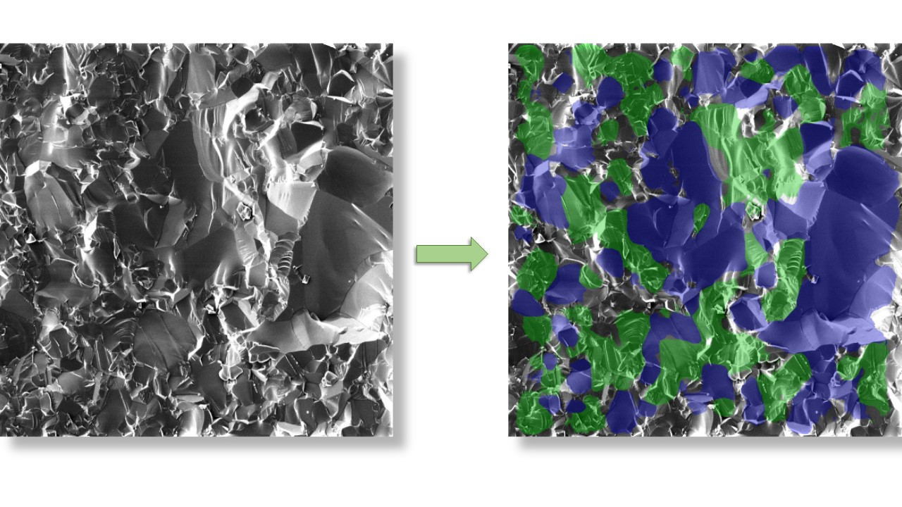

# Quantitative Fractography Image Segmentation

This repository is created to present the training process and the predictions results that are published on the scientific research work: _" Toward quantitative fractography using convolutional neural networks "_.

The source code is a modification of the code published at [image-segmentation-keras](https://github.com/divamgupta/image-segmentation-keras), with the addition of some extra tools needed for the training process. 

The main objective of publishing this work is to propose a new method for the topographic charactirization of fracture surfaces based on Convolutional Neural Networks and attract the interest of the Fractography research community in order to built on this basis and develop tools that optimize the Quantitative Fractogrphy techniques. 

More specifically, the Convolutional Neural Network (CNN) model after being trained in Scanning Electron Microscopy (SEM) images of fracture surfaces is able to identify the _intergranular_ or _transgranular_ fracture modes for any brittle material.

## Annotation of the training and validation datasets

The first part of the training of every Convolutional Neural Network (CNN) model involveds the annotation of the images. In our case the dataset is composed by SEM images of the fracture surfaces.

