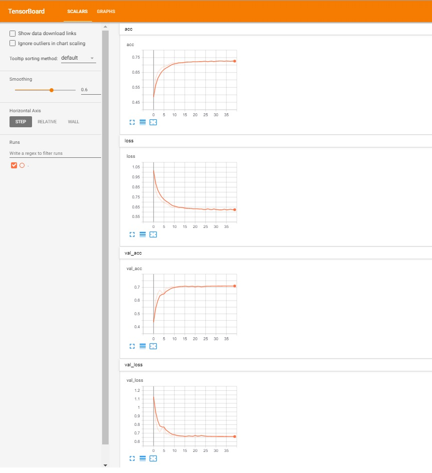

This folder contains the Tensorboard log files that can be used to monitor the training and validation accuracy, during the training process.

Run the following command:

```
tensorboard --logdir=directory-of-log-files  --host=127.0.0.1
```

and open the local host URL with the internet browser.



